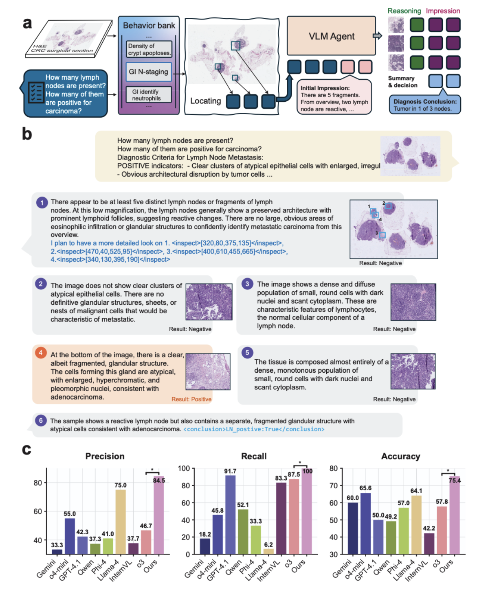

# Pathology-CoT: Learning Visual Chain-of-Thought Agent from Expert Whole Slide Image Diagnosis Behavior

[](https://arxiv.org/abs/2510.04587)

> **TL;DR:** We introduce a scalable framework to convert expert pathologist viewing behavior into structured Chain-of-Thought training data. By recording and processing routine diagnostic sessions, we enable AI agents to learn **where to look** and **why it matters** in whole-slide images—turning tacit clinical expertise into accessible supervision.

---

## 📖 Overview

Diagnosing whole-slide images (WSIs) is an interactive, multi-stage process requiring pathologists to dynamically change magnification and move between fields of view. While recent pathology foundation models are powerful, practical agentic systems that autonomously decide what to examine, adjust magnification, and deliver explainable diagnoses remain elusive.

**The bottleneck?** Data. We need scalable, clinically aligned supervision of expert viewing behavior—tacit knowledge that isn't written in textbooks or found online.

This repository introduces:

1. **AI Session Recorder**: Converts raw pathology viewer logs into structured behavioral commands and rationales with ~6x efficiency gain over manual annotation
2. **Pathology-CoT Dataset**: The first large-scale public dataset pairing expert navigation behavior with clinical reasoning (5,222 conversation rounds from 10.6 hours of diagnostic sessions)
3. **Pathologist-O3 Agent**: A demonstration agent showing how behavior-guided reasoning can be applied to colorectal lymph node metastasis detection

---


## 🛠️ Repository Structure

```
Pathology-CoT/
├── ai-session-recorder/          # Tools for converting viewer logs to CoT data
│   ├── NucleiioLog.py           # Parse WSI viewer logs into BehaviorRecords
│   ├── VLMAction.py             # Convert behaviors into VLM-friendly actions
│   ├── generate_conversation.py  # Generate conversational CoT annotations
│   └── examples/                # Example output images
├── pathology-cot/
│   ├── Dataset/                 # Pathology-CoT dataset
│   │   └── part1/              # 2688 files: images + conversation.json
│   └── GUI_validate/           # Human-in-the-loop validation interface
│       ├── index.html          # Main validation GUI
│       └── start_gui.py        # Launch the validation server
└── pathology-o3/
    ├── behavior_predictor.pt    # YOLO weights for ROI prediction
    └── think_ln_classify.py     # VLM-based reasoning agent
```

---

## 🔬 AI Session Recorder

The AI Session Recorder transforms raw, high-frequency pathology viewer logs into structured, meaningful training data through a three-stage pipeline:

<div align="center">

</div>

### What It Does

1. **Parses Raw Logs**: Extracts viewing events (zoom, pan, ROI changes) from digital pathology software
2. **Discretizes Behavior**: Converts continuous navigation into discrete actions:
   - `<inspect>`: Broad exploratory scan at low-to-medium magnification (5x, 10x)
   - `<peek>`: Rapid high-magnification examination of cellular details (40x)
3. **Generates Rationales**: Uses VLMs to draft clinical explanations for each action
4. **Human-in-the-Loop Review**: Pathologists quickly validate/edit AI-generated text (~6x faster than manual typing)

### Framework Design

**Important:** Different WSI viewer software (Aperio ImageScope, QuPath, ASAP, SlideViewer, etc.) have different log formats and systems. The AI Session Recorder is designed as a **flexible interface framework** rather than a one-size-fits-all solution.

**Core Components:**
- `NucleiioLog.py`: Defines the `BehaviorRecord` data structure (viewer-agnostic)
- `VLMAction.py`: Converts behavior records into standardized VLM-friendly actions
- `generate_conversation.py`: Generates conversational annotations with VLM assistance

**Adapting to Your Viewer:**
You'll need to implement a custom parser for your specific WSI viewer's log format. The parser should extract:
- Timestamps
- Zoom levels / magnifications
- Viewport coordinates (x, y positions)
- Bounding boxes for each view

Then convert these into the standardized `BehaviorRecord` format. See `parse_wsi_logs()` in `NucleiioLog.py` for a reference implementation.

### Example Output

The `ai-session-recorder/examples/` folder contains sample outputs showing thumbnails with marked regions of interest, high-resolution ROI crops at different magnifications, and annotated viewing sequences.

---

## 🚀 Usage Guide

### 1. Install Dependencies

```bash
pip install opencv-python numpy matplotlib google-generativeai openai pillow reportlab pandas
```

### 2. Generate CoT Dataset from Viewer Logs

> **Note:** The following examples use a specific viewer log format. You'll need to adapt the parsing logic for your WSI viewer software. The key is to convert your viewer's logs into the `BehaviorRecord` format.

#### Step 1: Parse Viewer Logs

```python
from ai_session_recorder.NucleiioLog import parse_wsi_logs

# Parse raw log file into structured behavior records
log_file = "path/to/viewer_logs.log"
behavior_records = parse_wsi_logs(log_file)

# Each BehaviorRecord contains:
# - wsi_path: Path to the whole-slide image
# - zoom_levels: Sequence of magnification levels
# - point_chain: Sequence of (x, y) coordinates
# - bounding_boxes: ROI coordinates
# - zoom_times: Time spent at each zoom level
```

#### Step 2: Extract VLM-Friendly Actions

```python
from ai_session_recorder.VLMAction import BehaviorProcessor

# Convert raw behaviors into discrete actions
processor = BehaviorProcessor(
    static_inspect_threshold_s=1.0,  # Min duration for inspect action
    pan_inspect_threshold_s=2.0      # Min duration for pan action
)

vlm_actions = processor.process_record(behavior_records[0])

# Output: List of VLMAction objects with:
# - action_type: 'StayInspect' or 'PanInspect'
# - magnification_bin: '5x' or '10x'
# - bounding_box: (x_min, y_min, x_max, y_max)
# - start_time, end_time
```

#### Step 3: Generate Conversational Annotations

```python
# Configure your VLM API key
export GENAI_API_KEY="your-google-genai-api-key"
export GENAI_MODEL="gemini-2.5-pro-preview-03-25"

# Run annotation generation
python ai-session-recorder/generate_conversation.py /path/to/case_folder

# Output: conversation.json with structured dialogue
```

**Example `conversation.json` structure:**
```json
[
  {
    "role": "user",
    "content": [
      {"type": "text", "text": "What is your initial impression?"},
      {"type": "image", "image": "thumbnail.jpeg"}
    ]
  },
  {
    "role": "assistant",
    "content": [
      {"type": "text", "text": "I observe multiple lymph nodes with preserved architecture..."}
    ]
  },
  {
    "role": "system",
    "content": [
      {"type": "text", "text": "This is ROI 1. What do you observe when you zoom in?"},
      {"type": "image", "image": "box_1.jpeg"},
      {"type": "image", "image": "cyto_box_1.jpeg"}
    ]
  },
  {
    "role": "assistant",
    "content": [
      {"type": "text", "text": "This region shows atypical epithelial cells..."}
    ]
  }
]
```

### Command-Line Options

```bash
# Process a case folder
python generate_conversation.py /path/to/case_folder

# Debug mode (process only first 2 boxes)
python generate_conversation.py /path/to/case_folder --debug
```

---

## 📊 Pathology-CoT Dataset

### Dataset Overview

The **Pathology-CoT** dataset is the first large-scale public resource pairing expert pathologist viewing behavior with clinical reasoning.

**Statistics:**
- 🕐 **10.6 hours** of diagnostic sessions
- 👥 **8 pathologists** (residents, fellows, attendings) from Stanford Medicine
- 💬 **5,222 conversation rounds** (behavior-reasoning pairs)
- 🔬 **Task**: Colorectal cancer lymph node metastasis detection

### Dataset Structure

Each case folder contains:

```
SS7324_1_31_b61eb1fa016e48f4978785bb54c7f23c/
├── thumbnail.jpeg                    # WSI thumbnail (low magnification overview)
├── thumbnail_with_boxes.jpeg         # Thumbnail with all ROI boxes marked
├── box_1.jpeg, box_2.jpeg, ...      # Medium magnification ROI crops (~10x)
├── cyto_box_1.jpeg, ...             # High magnification cytology views (~40x)
├── thumbnail_with_box_1.jpeg, ...   # Thumbnails showing individual ROI locations
└── conversation.json                 # Structured diagnostic conversation
```

### Accessing the Dataset

```python
import json
import os

# Load a case
case_dir = "pathology-cot/Dataset/part1/SS7324_1_31_b61eb1fa016e48f4978785bb54c7f23c"

# Read the conversation
with open(os.path.join(case_dir, "conversation.json")) as f:
    conversation = json.load(f)

# Access images
from PIL import Image
thumbnail = Image.open(os.path.join(case_dir, "thumbnail.jpeg"))
roi_1 = Image.open(os.path.join(case_dir, "box_1.jpeg"))
```

---

## ✅ Human-in-the-Loop Validation GUI

To ensure data quality, we provide an interactive validation interface for expert review.

### Launching the GUI

```bash
cd pathology-cot/GUI_validate
python start_gui.py
```

This will:
1. Start a local web server (default: http://127.0.0.1:8000)
2. Automatically open the validation interface in your browser

### Features

- 📝 **Review AI-generated rationales**: Side-by-side comparison of images and text
- ✏️ **Edit annotations**: Quick inline editing of diagnostic reasoning
- ✓ **Approve/reject cases**: Quality control workflow
- 📊 **Progress tracking**: Monitor validation status across the dataset

### Manual Mode

For manual annotation from scratch, use `index_manual.html` instead of `index.html`.

---

## 🤖 Pathologist-O3 Agent (Demo)

### Architecture

**Pathologist-O3** is a demonstration agent showing how the Pathology-CoT dataset can be used to build behavior-guided diagnostic systems. It uses a two-stage architecture:

```
┌─────────────────────────────────────────────────┐
│  Stage 1: Behavior Prediction (Where to Look)  │
│  ┌──────────────────────────────────────────┐  │
│  │  YOLOv8 Behavior Predictor               │  │
│  │  • Trained on expert ROIs from           │  │
│  │    Pathology-CoT dataset                 │  │
│  │  • Weight: pathology-o3/                 │  │
│  │    behavior_predictor.pt                 │  │
│  │  • Proposes diagnostically relevant      │  │
│  │    regions to inspect                    │  │
│  └──────────────────────────────────────────┘  │
└─────────────────────────────────────────────────┘
                      ↓
┌─────────────────────────────────────────────────┐
│  Stage 2: Reasoned Analysis (What is Seen)     │
│  ┌──────────────────────────────────────────┐  │
│  │  Vision-Language Model (Gemini-2.5-Pro)  │  │
│  │  • Analyzes each proposed ROI            │  │
│  │  • Generates clinical findings           │  │
│  │  • Synthesizes final diagnosis           │  │
│  └──────────────────────────────────────────┘  │
└─────────────────────────────────────────────────┘
```

### System Overview

<div align="center">

</div>

**Figure:** (a) Complete workflow showing behavior bank integration with VLM agent for diagnostic reasoning, (b) Example case demonstrating multi-ROI analysis with chain-of-thought reasoning leading to final diagnosis, (c) Performance comparison to different VLM.

### Prerequisites

Before running the diagnostic agent, you need:

1. **YOLO Behavior Predictor**: Download `behavior_predictor.pt` ([Google Drive](https://drive.google.com/file/d/1Nt43q0R9j42w6qZFXp0J0fA_NwUlgqmb/view?usp=share_link))
   - Trained on expert viewing behavior from the Pathology-CoT dataset
   - Predicts where pathologists would look on a WSI
   - Place the downloaded file in `pathology-o3/behavior_predictor.pt`

2. **Extract ROIs**: Use YOLO to generate regions of interest from your WSI
   - The behavior predictor identifies diagnostically important areas
   - ROIs should be extracted at appropriate magnifications

3. **VLM API Access**: Choose a supported vision-language model for reasoning

### Running the Agent

**Workflow:**

1. **Generate ROIs using YOLO Behavior Predictor**
   ```bash
   # Use the provided YOLO weights to detect ROIs
   # Load weight: pathology-o3/behavior_predictor.pt
   # This will identify regions that expert pathologists would examine
   ```

2. **Prepare Case Data**
   - Extract ROI images at appropriate magnifications
   - Organize as: `case_folder/thumbnail.jpg`, `case_folder/roi_1.jpg`, etc.

3. **Run VLM-based Reasoning**
   ```bash
   # Configure API keys (if using commercial VLMs)
   export OPENAI_API_KEY="your-openai-api-key"
   
   # Run diagnosis on prepared case data with extracted ROIs
   python pathology-o3/think_ln_classify.py \
       -d /path/to/case_data \
       -o /path/to/output \
       -m gpt-4o \
       -n 5
   ```

**Note:** The YOLO behavior predictor must be run **first** to generate ROIs. The thinking/reasoning script (`think_ln_classify.py`) expects pre-extracted ROI images as input.

### Options

```
-d, --data-dir       Data directory containing case folders
-o, --output         Output folder for results
-m, --model          Model name (gpt-4o, gemini-2.5-pro, etc.)
-n, --num-cases      Number of cases to process
--image-history      Image history mode:
                     - current_only: Send only current ROI (default)
                     - full_history: Include all previous images
--annotation-file    Ground truth labels for evaluation
```

### Model Weights

- **`behavior_predictor.pt`**: Pre-trained YOLOv8 weights for ROI prediction
  - **Download**: [Google Drive](https://drive.google.com/file/d/1Nt43q0R9j42w6qZFXp0J0fA_NwUlgqmb/view?usp=share_link) (~130 MB)
  - Trained on expert viewing patterns from Pathology-CoT dataset
  - Use this to identify where to extract ROIs from WSIs
  
**Download Instructions:**
```bash
# Option 1: Manual download
# Click the link above and download through browser

# Option 2: Command line (using gdown)
pip install gdown
gdown https://drive.google.com/uc?id=1Nt43q0R9j42w6qZFXp0J0fA_NwUlgqmb -O pathology-o3/behavior_predictor.pt

# Option 3: Using wget
wget --load-cookies /tmp/cookies.txt "https://drive.google.com/uc?export=download&id=1Nt43q0R9j42w6qZFXp0J0fA_NwUlgqmb" -O pathology-o3/behavior_predictor.pt && rm -rf /tmp/cookies.txt
```
  
- **`think_ln_classify.py`**: VLM-based reasoning script
  - Analyzes pre-extracted ROIs
  - Generates diagnostic reasoning and conclusions

### Output

Each analysis produces:
- `analysis_results.json`: Structured diagnostic output with predictions
- `pathology_report.pdf`: Human-readable PDF report with images and findings
- Performance metrics (if ground truth provided)

### Supported VLMs

The demonstration agent supports multiple VLM backends:
- ✅ OpenAI (GPT-4o, GPT-4-turbo, O3)
- ✅ Google (Gemini-2.5-Pro, Gemini-Flash)
- ✅ Anthropic (Claude-3, Claude-3.5)
- ✅ X.AI (Grok-2)
- ✅ Open-source models via OpenRouter

**Note:** All source code is available. An **online demo** for easier experimentation is **coming soon**. The agent's performance depends primarily on the underlying VLM's capabilities; our contribution is the **data generation framework** that enables behavior-guided reasoning.

---

## 💡 Using the Dataset

### Using the Dataset for Training

```bash
# 1. Download the Pathology-CoT dataset
git clone https://huggingface.co/datasets/XXXX/Pathology-CoT

# 2. The dataset provides:
# - Expert viewing sequences (where to look)
# - Clinical rationales (why it matters)
# - Multi-magnification image crops
# - Structured conversation format

# 3. Run the example agent
python pathology-o3/think_ln_classify.py \
    -d pathology-cot/Dataset/part1 \
    -o results/example-run \
    -m gemini-2.5-pro \
    -n 5
```

---

## 🤝 Contributing

We welcome contributions! Key areas of interest:

- 🔌 **Integration with other WSI viewers** (TissueLab, QuPath, ASAP, etc.) - expand data collection capabilities
- 📊 **Dataset expansion**: Apply the AI Session Recorder to new pathology tasks (grading, subtyping, IHC scoring)
- 🛠️ **Improved annotation tools**: Enhance the human-in-the-loop validation GUI
- 🔬 **Novel applications**: Use the Pathology-CoT dataset to train new types of models
- 📖 **Documentation**: Add tutorials, examples, and use cases

Please open an issue or submit a pull request.

---

## 📄 Citation

If you find this work useful, please cite:

```bibtex
@misc{wang2025pathologycotlearningvisualchainofthought,
      title={Pathology-CoT: Learning Visual Chain-of-Thought Agent from Expert Whole Slide Image Diagnosis Behavior}, 
      author={Sheng Wang and Ruiming Wu and Charles Herndon and Yihang Liu and Shunsuke Koga and Jeanne Shen and Zhi Huang},
      year={2025},
      eprint={2510.04587},
      archivePrefix={arXiv},
      primaryClass={cs.CV},
      url={https://arxiv.org/abs/2510.04587}, 
}
```

---

## 🔗 Links

- 📄 **Paper**: [arXiv:2510.04587](https://arxiv.org/abs/2510.04587)
- ⚖️ **Model Weights**: [Google Drive](https://drive.google.com/file/d/1Nt43q0R9j42w6qZFXp0J0fA_NwUlgqmb/view?usp=share_link) (behavior_predictor.pt, 130 MB)
- 🌐 **Demo**: Coming Soon!
- 💬 **Issues**: [GitHub Issues](https://github.com/zhihuanglab/Pathology-CoT/issues)

---


## 🙏 Acknowledgments

- **Stanford Medicine** pathology department for contributing their time and expertise to create the Pathology-CoT dataset
- **OpenRouter** for supporting research with model access
- The open-source pathology AI community for tools and feedback

---

## 📬 Contact

For questions or collaborations, please:
- Open an issue on GitHub
- Contact the authors (see paper for details)

---

<div align="center">
Made with ❤️ for advancing AI in pathology
</div>
